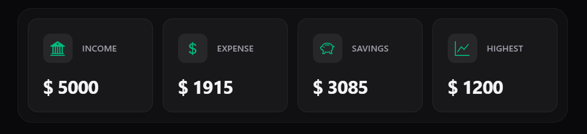
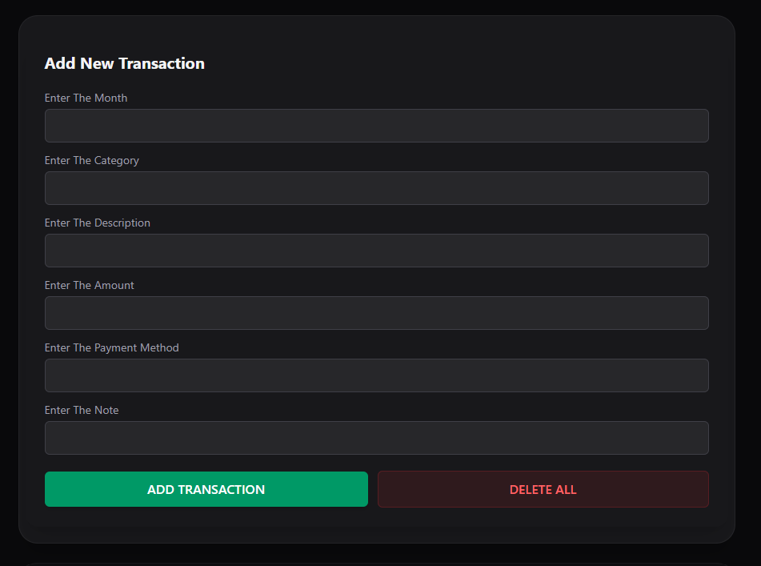

# 💸 Expense Tracker Dashboard

A dark-themed personal finance dashboard built with React, Vite, and Tailwind CSS. Track your spending, monitor savings, and sort transactions — all from a clean, minimal UI that remembers your data even after you close the tab.

🔗 **Live Demo:** [expense-tracker-gamma-sable-20.vercel.app](https://expense-tracker-gamma-sable-20.vercel.app)  
📁 **GitHub:** [github.com/hameedullah34](https://github.com/hameedullah34)

---

## Screenshots

### Dashboard Overview


### Summary Cards



### Add New Transaction



### Sorted by Month


### Transaction Table


---

## Features

- 📊 **Live Summary Cards** — Income, Expenses, Savings, and Biggest Expense update automatically as you add transactions
- ➕ **Add Transactions** — Log expenses with month, category, description, amount, payment method, and notes
- 🗂️ **Sort Transactions** — Sort your expense table by Month, Category, or Payment Mode instantly
- 🗑️ **Delete All** — Clear all transactions with one click
- 💾 **localStorage Persistence** — Your data survives page refreshes — no backend needed
- ⚡ **Derived State** — Totals are calculated live from your data, no manual updates needed

---

## How It Works

All expense data lives in a single **React Context** (`TransactionContext`). Every component that needs data — the summary cards, the form, the table — pulls from this one source of truth.

When you add a transaction:

1. The expenses array in context updates
2. Every connected component re-renders automatically
3. Summary cards recalculate from the new array
4. Data is saved to localStorage in the same action

When you refresh:

1. `useEffect` reads localStorage on mount
2. Restores the full expenses array into state
3. UI renders as if you never left

---

## Tech Stack

| Technology   | Purpose                 |
| ------------ | ----------------------- |
| React 18     | UI Library              |
| Vite         | Build Tool              |
| Tailwind CSS | Styling                 |
| React Icons  | Icon Library            |
| useContext   | Global State Management |
| localStorage | Client-side Persistence |

---

## Getting Started

```bash
# Clone the repository
git clone https://github.com/hameedullah34/expense-tracker.git

# Navigate into the project
cd expense-tracker

# Install dependencies
npm install

# Start the development server
npm run dev
```

App runs at `http://localhost:5173`

---

## Project Structure

```
src/
├── Components/
│   ├── index.jsx                       # Barrel file for clean imports
│   ├── Summery.jsx                     # Summary cards (Income, Expense, Savings, Highest)
│   ├── Form.jsx                        # Add transaction form
│   ├── Display.jsx                     # Filter buttons + table wrapper
│   ├── ExpenseTable.jsx                # Sortable transaction table
│   ├── TransactionContext.jsx          # React Context definition
│   └── TransactionContextProvider.jsx # Global state + localStorage logic
└── App.jsx                             # Root component with derived state calculations
```

---

## What I Learned Building This

- **useContext** — managing global state without prop drilling across multiple components
- **Derived state** — calculating totals from arrays instead of storing them as separate states
- **localStorage with React** — persisting state across sessions using useEffect on mount
- **Array sorting** — using `.sort()` with `localeCompare` for dynamic table sorting
- **Component architecture** — deciding what lives in context vs local state vs derived values

---

## Author

**Hameed Ullah** — [@hameedullah34](https://github.com/hameedullah34)

---

## License

Open source under the [MIT License](LICENSE).
